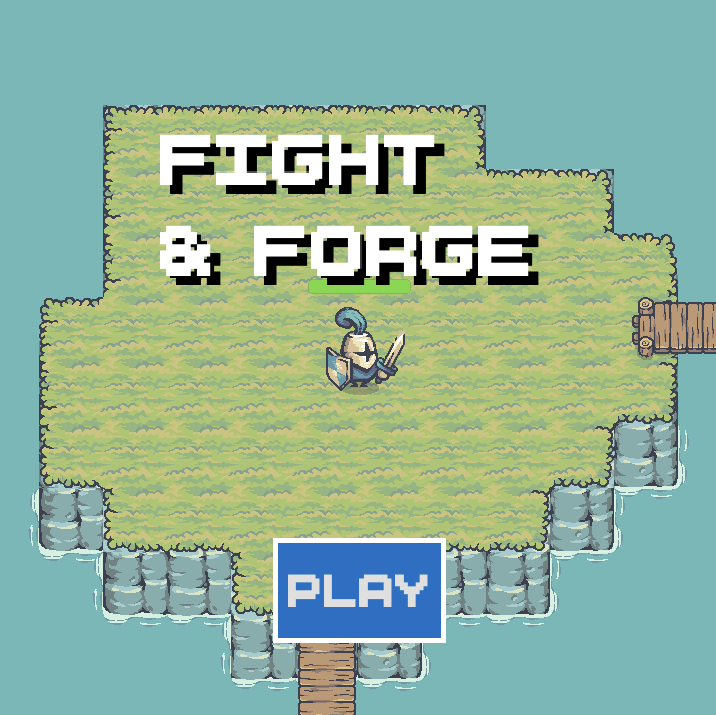

# Fight & Forge

A top-down 2D pixel-art action game made with Godot 4.

## Controls

| Input | Action |
|-------|--------|
| `W` `A` `S` `D` | Move |
| `Space` | Attack |

## Scoring

Each enemy defeated grants **+1 point**. Survive as long as you can and aim for a high score!

## Built With

- [Godot Engine 4](https://godotengine.org/)

## Development Notes

### Collision Layers

| # | Layer | Used for |
|---|-------|----------|
| 1 | `terrain` | Ground and level geometry |
| 2 | `player` | Player body |
| 4 | `enemy` | Enemy bodies |
| 5 | `enemy_hit_layer` | Hit detection for attacks on enemies |

## Credits

### Assets

- **Smoke FX** — [FX062](https://nyknck.itch.io/fx062) by [nyknck](https://nyknck.itch.io/)
